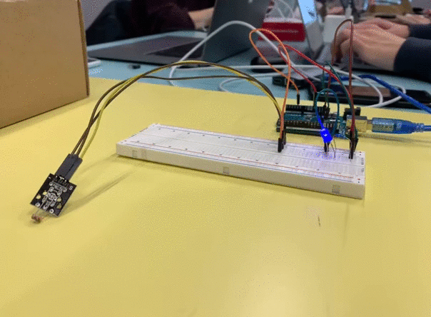
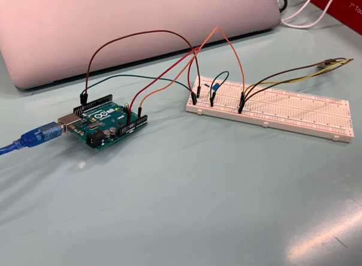

# Start the program

## Setup env
```
pip3 install flask
export FLASK_APP=webserver
export FLASK_ENV=development
```

### Run the web server
```
flask run
```


## Instructions

1 / Capteur sur l'arduino
- Branchement
- Récupération de la valeur toutes les 500ms

**Tout d'abord, on effectue les branchements sur notre Arduino pour communiquer entre les 2 périphériques**

<div style="text-align:center">
    
</div>

**Ensuite, on vérifie que l'on récupère bien les données du capteur**

<div style="text-align:center">
    
</div>

---

2 / Allumer une LED à chaque mesure pendant 200ms

**Une fois les branchements réalisés, on fait clignoter la led à intervalle régulier**

<div style="text-align:center">
    
</div>
 
---
3 / Connecter un Raspberry à l'arduino
- Avec un cable USB
- ou par les GPIO
- Transmettre les valeurs au Raspberry

**On connecte ensuite le raspberry à l'arduino pour qu'il récupère les données**

<div style="text-align:center">
    
</div>

 ---

4 / Ecrire un programme dans le langage de votre choix qui lira la valeur du capteur

**Pour récupérer ces données, on écrit on programme simple sur l'IDE Arduino**

<div style="text-align:center">
    
</div>

 ---

5 / Bonus: Ecrire un serveur Web qui expose la valeur sur une API (langage de votre choix)

**Pour le serveur Web, nous avons décidé d'utiliser Flask, qui est un framework Python qui nous permet ici de développer une API et une interface web à partir d'un projet**

<div style="text-align:center">
    
</div>

 ---

6 / Bonus: Permettre via l'API du Raspberry, d'inverser le clignotement de la LED (reste allumée en permanence mais s'éteint 200ms à chaque mesure)

**On crée une route pour modifier le clignotement de la led.**

<div style="text-align:center">
    
</div>

---

## Contributors

- [@matteolecuit](https://github.com/matteolecuit)
- [@PaulLereverend](https://github.com/PaulLereverend)
- [@HugoHUET](https://github.com/HugoHUET)
- [@geoffrey-max](https://github.com/geoffrey-max)
- [@adrienvaucard](https://github.com/adrienvaucard)
